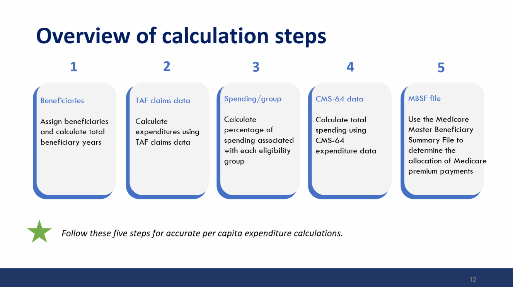

Presenter: Ali Fokar

## Overview of Calculation Steps

1. **Beneficiaries** - Assign beneficiaries and calculate total beneficiary years
1. **TAF Claims Data** - Calculate expenditures using TAF claims data
1. **Spending/group** - Calculate percentage of spending associated with each eligibility group
1. **CMS-64 data** - Calculate total spending using CMS-64 expenditure data
1. **MBSF File** - Use the Medicare Master Beneficiary Summary File to determine the allocation of Medicare premium payments

